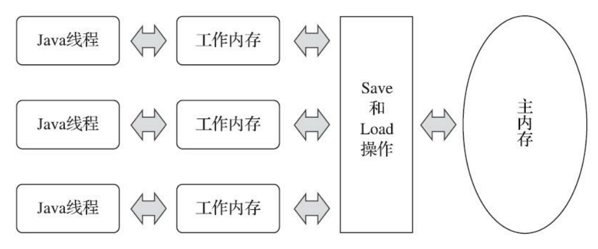
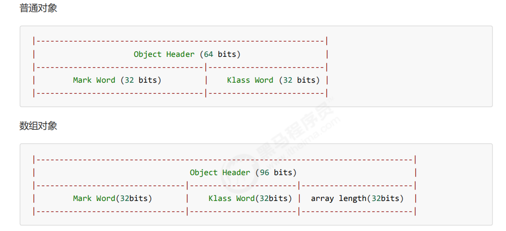
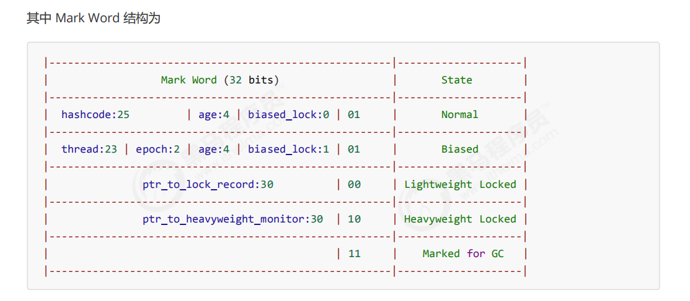
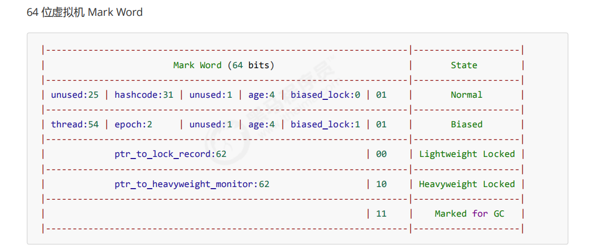
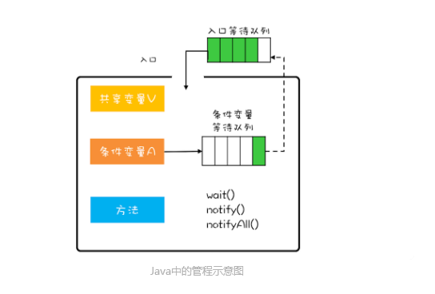
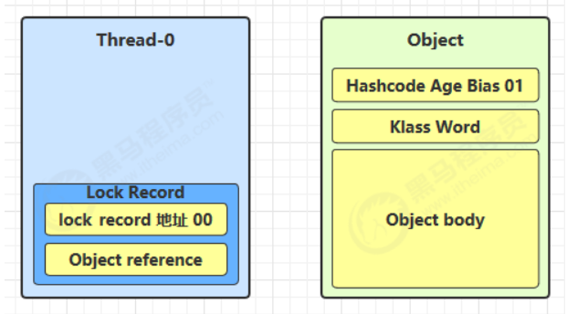
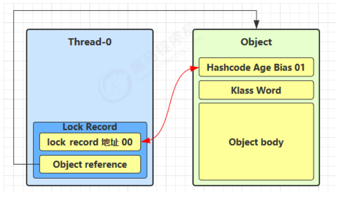
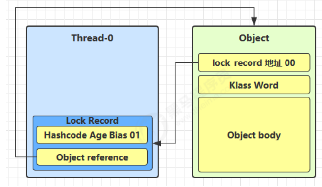
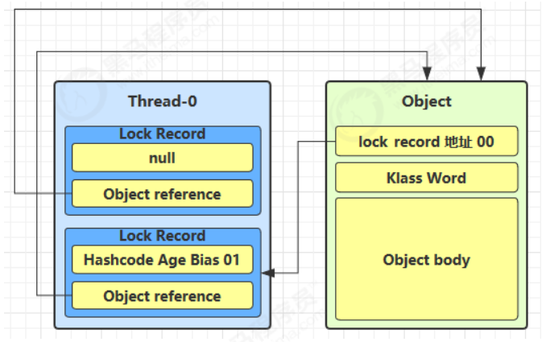
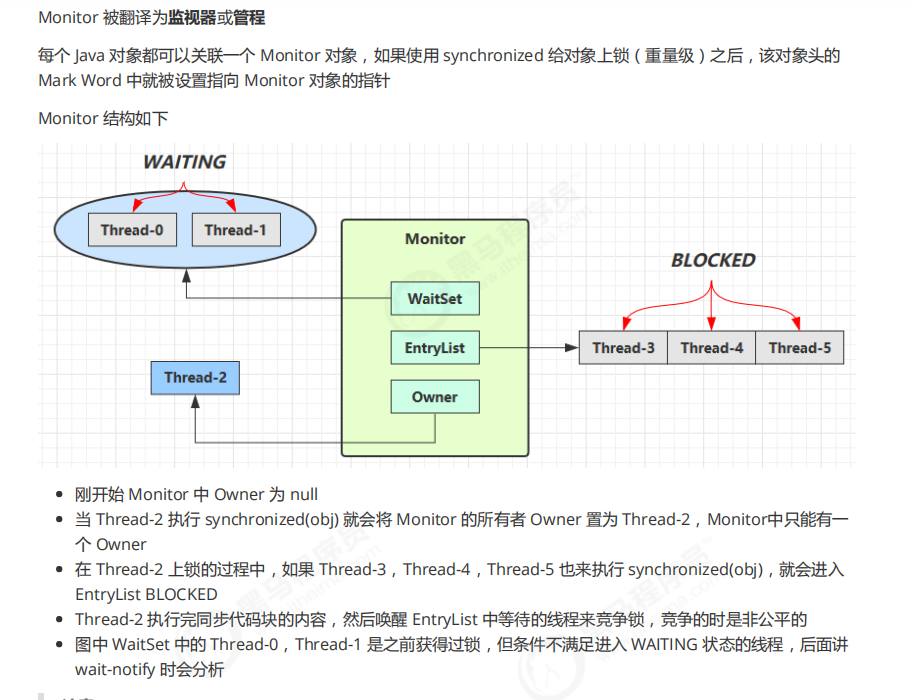

##  Java内存模型(JMM)

### Java并发解决的三个问题

- **可见性**-保证指令不会受cpu缓存的影响

```java
//加锁的时候会导致可见性，println是加锁的，所以while里面加了输出就会同步，
//用来解释可见性的问题，
   static volatile boolean run = true;

    public static void main(String[] args) throws InterruptedException {
        Thread t =new Thread(()->{
            while(run){
            }
        });
        t.start();

        Thread.sleep(1000);
        System.out.println("停止");
        run = false;
    }
```



如上图所示，为JMM内存模型，每一个线程都有自己的工作内存，这里保存了变量的副本，所有的修改操作都是在工作内存中完成后，刷新到主内存，内存之间的通信也是通过主内存进行的。由于上面的原因导致了可见性的问题。

- **有序性**-保证指令不会受cpu指令并行优化的影响

```java
/*
可能出现的情况
情况1：线程1 先执行，这时 ready = false，所以进入 else 分支结果为 1
情况2：线程2 先执行 num = 2，但没来得及执行 ready = true，线程1 执行，还是进入 else 分支，结果为1
情况3：线程2 执行到 ready = true，线程1 执行，这回进入 if 分支，结果为 4（因为 num 已经执行过了）
情况4：线程2 执行 ready = true，切换到线程1，进入 if 分支，相加为 0，再切回线程2 执行 num = 2，出现了指令重排序
*/

int num = 0;
boolean ready = false;
// 线程1 执行此方法
public void actor1(I_Result r) {
     if(ready) {
         r.r1 = num + num;
     } else {
    	 r.r1 = 1;
     }
}
// 线程2 执行此方法
public void actor2(I_Result r) { 
     num = 2;
     ready = true; 
}
```


可以看到0的结果还是出现了，尽管出现的情况不多。

重排序分为下面几种，为了避免各种重排序，需要加入内存屏障。


- **原子性**-保证指令不会受到线程上下文切换的影响

  下面是一个普通的i++操作。可以看到分了4条指令，必须保证在这四条指令执行的期间不能发生线程切换，否则就会报错。


### Happen-Before原则：

Happen-Before原则，说明的是前一个操作对后一个操作是可见的。这个原则就是方便程序员理解编译器的重排序规则，更好的理解可见性

重排序的原则：

1. 重排序不能改变如下的数据依赖


2. 不管怎么重排序，不能改变程序的执行结果，要像串行一样，即as-if-serial
3. 在临界区内可以重排序，但不能让临界区内的代码逃逸出临界区。synchronized包裹的程序可以重排序，但是不能有里面的变量可以在外面访问。

Happen-Before原则

1.  按照程序顺序，前面的操作 Happens-Before 于后续的任意操作。
2. 一个 volatile 变量的写操作， Happens-Before 于后续对这个 volatile变量的读操作。
3. 这条规则是指如果 A Happens-Before B，且 B Happens-Before C，那么 A Happens-Before C。
4. 这条规则是指对一个锁的解锁 Happens-Before 于后续对这个锁的加锁。
5. 它是指主线程 A 启动子线程 B 后，子线程 B 能够看到主线程在启动子线程 B 前的操作。
6. 它是指主线程 A 等待子线程 B 完成（主线程 A 通过调用子线程 B 的 join() 方法实现），当子线程 B 完成后（主线程 A 中 join() 方法返回），主线程能够看到子线程的操作

## volatile原理

volatile适用一个线程写多个线程读取的情况

有volatile变量修饰的代码，反汇编之后会加上lock前缀，这个前缀会产生两个效果。

- Lock前缀指令会引起处理器缓存写回到内存
- 一个处理器的缓存写回到内存会导致其他处理器的缓存无效。

volatile更底层的实现是内存屏障

- 对volatile的写指令会插入写屏障，写屏障保证在该屏障之前的，对共享变量的改动，都同步到主存当中。
- 对volatile的读指令会插入读屏障，读屏障保证在该屏障之后，对共享变量的读取，加载的是主存中最新数据

volatile禁止重排序的种类：


- 当第二个操作是volatile写时，不管第一个操作是什么，都不能重排序。这个规则确保 volatile写之前的操作不会被编译器重排序到volatile写之后。 

- 当第一个操作是volatile读时，不管第二个操作是什么，都不能重排序。这个规则确保 volatile读之后的操作不会被编译器重排序到volatile读之前。 

- 当第一个操作是volatile写，第二个操作是volatile读时，不能重排序。

为了实现上面的语义，需要以下重排序操作的配合。


- 在每个volatile写操作的前面插入一个StoreStore屏障。 

- 在每个volatile写操作的后面插入一个StoreLoad屏障。 

- 在每个volatile读操作的后面插入一个LoadLoad屏障。 

- 在每个volatile读操作的后面插入一个LoadStore屏障。

  下面的LoadLoad屏障用来禁止处理器把上面的volatile读与下面的普通读重排序。LoadStore屏障用来禁止处理器把上面的volatile读与下面的普通写重排序

  

下面的StoreStore屏障可以保证在volatile写之前，其前面的所有普通写操作已经对任 意处理器可见了。这是因为StoreStore屏障将保障上面所有的普通写在volatile写之前刷新到主内存。volatile写后面的StoreLoad屏障的作用是避免volatile写与后面可能有的volatile读/写操作重排序


## synchronized实现原理

### Java对象头

对象在内存中分为三块区域：

- 对象头

  1. MarkWord(标记字段)，默认存储对象的HashCode，分代年龄和锁标志位信息。里面存储的数据会随着锁标志位的变化而变化。
  2. Klass Point(类型指针)，对象指向它的类元数据指针，通过这个指针确定对象是那个类的实例

- 实例数据

  存放类的数据信息，父类信息

- 对齐填充

  虚拟机要求对象起始地址必须是8字节的整倍数，填充数据不是必须存在的，仅仅是为了字节对齐

32位虚拟机中对象头的组成



32位虚拟机中对象头的组成

64位虚拟机中对象头的组成



**biased_lock**：对象是否启用偏向锁标记，只占1个二进制位。为1时表示对象启用偏向锁，为0时表示对象没有偏向锁。
 **age**：4位的Java对象年龄。在GC中，如果对象在Survivor区复制一次，年龄增加1。当对象达到设定的阈值时，将会晋升到老年代。默认情况下，并行GC的年龄阈值为15，并发GC的年龄阈值为6。由于age只有4位，所以最大值为15，这就是`-XX:MaxTenuringThreshold`选项最大值为15的原因。
 **identity_hashcode**：25位的对象标识Hash码，采用延迟加载技术。调用方法`System.identityHashCode()`计算，并会将结果写到该对象头中。当对象被锁定时，该值会移动到管程Monitor中。
 **thread**：持有偏向锁的线程ID。
 **epoch**：偏向时间戳。
 **ptr_to_lock_record**：指向栈中锁记录的指针。
 **ptr_to_heavyweight_monitor**：指向管程Monitor的指针。

### 管程

管程，对应的英文是Monitor，指管理共享变量以及对共享变量操作的过程，让他们支持并发。在管程的发展历史上分别有三种不同的管程模型，分别是Hasen模型，Hoare模型，MESA模型。

并发领域要解决的问题：

- 互斥：即同一时刻只允许一个线程访问共享资源。
- 同步：即线程之间如何通信，协作。

管程的解决方法：

- 互斥：将共享变量及其对共享变量的操作统一封装起来。

- 同步：利用条件变量和条件变量等待队列。

  

在管程模型里，共享变量和对共享变量的操作是被封装起来的，最外层的框就是封装的意思。每一个条件变量都对应一个等待队列。例如，现在线程T1执行阻塞队列的出队操作，如果队列是空的就到条件变量对应的等待队列里面等。如果T2执行阻塞队列的入队操作。队列满了，进入对应条件变量的等待队列里面等。

```java
//阻塞队列的实现上面的思想
public class BlockedQueue<T>{
  final Lock lock =
    new ReentrantLock();
  // 条件变量：队列不满  
  final Condition notFull =
    lock.newCondition();
  // 条件变量：队列不空  
  final Condition notEmpty =
    lock.newCondition();

  // 入队
  void enq(T x) {
    lock.lock();
    try {
      while (队列已满){
        // 等待队列不满 
        notFull.await();
      }  
      // 省略入队操作...
      //入队后,通知可出队
      notEmpty.signal();
    }finally {
      lock.unlock();
    }
  }
  // 出队
  void deq(){
    lock.lock();
    try {
      while (队列已空){
        // 等待队列不空
        notEmpty.await();
      }
      // 省略出队操作...
      //出队后，通知可入队
      notFull.signal();
    }finally {
      lock.unlock();
    }  
  }
}
```

1. Hasen 模型里面，要求 notify() 放在代码的最后，这样 T2 通知完 T1 后，T2 就结束了，然后 T1 再执行，这样就能保证同一时刻只有一个线程执行。
2. Hoare 模型里面，T2 通知完 T1 后，T2 阻塞，T1 马上执行；等 T1 执行完，再唤醒 T2，也能保证同一时刻只有一个线程执行。但是相比 Hasen 模型，T2 多了一次阻塞唤醒操作。
3. MESA 管程里面，T2 通知完 T1 后，T2 还是会接着执行，T1 并不立即执行，仅仅是从条件变量的等待队列进到入口等待队列里面。这样做的好处是 notify() 不用放到代码的最后，T2 也没有多余的阻塞唤醒操作。但是也有个副作用，就是当 T1 再次执行的时候，可能曾经满足的条件，现在已经不满足了，所以需要以循环方式检验条件变量。

下面是Java中管程的实现


### 各种锁

锁的升级顺序如下

- 偏向锁：解决同一个线程多次获得锁时候的代价。
- 轻量级锁：如果一个对象虽然有多线程访问，但多线程访问的时间是错开的（也就是没有竞争），那可以使用轻量级锁来优化。轻量级锁对使用者是透明的，即语法依然是synchronized

#### 偏向锁

在第一次进入的时候，需要CAS将线程ID放在对象的MarkWord头，之后发现线程ID是自己的就表示没有竞争，不需要重新CAS。只要不发生竞争，这个对象就归线程所有。

- 调用hashcode()方法，会导致偏向锁被禁用，直接调用轻量级锁。因为偏向锁的Markword中没有存储hashcode的位置，轻量级锁会在锁记录中记录hashCode，重量级锁会在Monitor中记录hashCode。

- 当有其他线程调用偏向锁对象的时候，会升级成轻量级锁。注意，是在当前线程执行完synchronized方法之后调用，否则就会升级成重量级锁。

- 调用wait，notify也会撤销偏向锁，因为只有重量级锁有这两个方法。

#### 轻量级锁

加锁过程：

1. 创建锁记录对象(LockRecord)，每个线程的栈帧都会包含一个锁记录的结构，内部可以存储锁定对象的Mark Word。

    

2. 让锁记录中的Object reference指向锁对象，并尝试用cas替换Object的Mark Word，将MarkWord存入锁记录（就是这里存储了HashCode）。

    

3. 如果cas替换成功，对象头中存储了锁记录的地址和状态00，表示由该线程给对象加锁。

    

4. 如果cas失败，有两种情况

    (1)如果是其他线程持有了Object的轻量级锁，表名有竞争，进入锁膨胀过程。

    (2)如果是自己执行了synchronized锁充入，则在添加一条LockRecord作为重入的计数。

    

锁膨胀：如果别的线程CAS的时候，发现已经有线程加了偏向锁1，自己会申请Monitor锁，让Object指向重量级锁地址，同时自己进入Monitor的EntryList阻塞。

自旋转优化：如果在争取的时候发现阻塞，可以先自旋尝试获取锁，失败10次后进入锁膨胀。

#### 重量级锁

Java中Monitor的详细情况

加入synchonized之后，在子字节码中会出现MonitorEnter和MonitorExit两条指令。



## 线程池


Executor框架分为三个大部分，所有实现了Runnable借口和Future接口的类都能被ThreadPoolExecutor和ScheduledThreadPoolExecutor执行：

- 任务：包括被执行任务需要实现的接口：Runnable和Callable接口。

- 任务的执行，ThreadPoolExecutor是线程池的核心实现类，用来执行被提交的任务，ScheduledThreadPoolExecutor是一个延迟后运行的命令。

- 异步计算的结果，Future接口和FutureTask类。

Executor框架执行的示意图如下：主线程创建Runnable或者Callable接口的任务对象，并且提交到ExecutorService执行，执行后如果有结果通过Future对象返回。

  

  

  

```java
 public ThreadPoolExecutor(int corePoolSize,
                              int maximumPoolSize,
                              long keepAliveTime,
                              TimeUnit unit,
                              BlockingQueue<Runnable> workQueue,
                              ThreadFactory threadFactory,
                              RejectedExecutionHandler handler) {
```

- corePoolSize核心线程数目（最多保留线程数）
- maximumPoolSize最大线程数目
- keepAliveTime生存时间-针对急救线程
- unit时间单位-针对就即线程
- workQueue阻塞队列
- threadFactory线程工厂-可以为线程创建时起个好名字
- handler拒绝策略

**线程池的工作流程**：

1. 线程池开始的时候没有线程，当任务被提交给线程后，线程池会创建一个新线程来执行任务。

2. 当线程数达到了corePoolSize且并没有线程空闲时间，这时在加入任务，会被添加到workQueue队列排队，直到有空闲的线程。

3. 如果队列选择了有界队列，当任务超过了队列大小时，会创建maximumPoolSize-corePoolSize数目的线程来救急。

4. 当线程达到maximumPoolSize的时候，仍然有任务加入，会执行拒绝策略。

   - AbortPolicy让调用者抛出RejectedExecutionException异常，这是默认策略

   - CallerRunsPolicy让调用者运行任务

   - DiscardPolicy放弃本次任务

   - DiscardPolicy放弃队列中最早的任务，取而代之。

 

## Lock原理

Concurrent包的结构


### Lock锁的内存语义

- 锁释放与volatile写有相同的内存语义，当线程释放锁的时候，JMM会把该线程对应的本地内存中的共享变量刷新到主内存中。
- 锁获取与volatile读有相同的内存语义，当线程获取锁时候，JMM会把该线程对应的本地内存置为无效。

### AQS原理


全称是AbstractQueuedSynchronizer，是阻塞式锁和相关同步器工具的框架。

- 用state属性来表示资源的状态（分独占模式和共享模式），子类需要定义如何维护这个状态，控制如何获取锁和释放锁。
  - getState-获取state状态
  - setState-设置state状态
  - compareAndSetState-cas机制设置state状态
  - 独占模式只是有一个线程能访问资源，而共享模式可以允许多个线程访问资源

- 提供了基于FIFO的等待队列，类似于Monitor的EntryList

- 条件变量来实现等待，唤醒机制，支持多个条件变量，类似于Monitor的WaitSet

- 子类要实现这样一些方法（默认抛出UnsupportedOperationException）

  - tryAcquire

  - tryRelease

  - tryAcquireShared

  - tryReleaseShared

  - isHeldExclusively

```java
final class MySync extends AbstractQueuedSynchronizer {
     @Override
     protected boolean tryAcquire(int acquires) {
         if (acquires == 1){
             if (compareAndSetState(0, 1)) {
                 setExclusiveOwnerThread(Thread.currentThread());
                 return true;
             }
         }
         return false;
     }
    
     @Override
     protected boolean tryRelease(int acquires) {
         if(acquires == 1) {
         if(getState() == 0) {
        	 throw new IllegalMonitorStateException();
     	 }
         setExclusiveOwnerThread(null);
         setState(0);
         return true;
         }
         return false;
     }
     
     protected Condition newCondition() {
         return new ConditionObject();
     }
     
     @Override
     protected boolean isHeldExclusively() {
     return getState() == 1;
     }
}

class MyLock implements Lock {
     static MySync sync = new MySync();
     
     @Override
     // 尝试，不成功，进入等待队列
     public void lock() {
         sync.acquire(1);
     }
    
     @Override
     // 尝试，不成功，进入等待队列，可打断
     public void lockInterruptibly() throws InterruptedException {
    	 sync.acquireInterruptibly(1);
     }
    
     @Override
     // 尝试一次，不成功返回，不进入队列
     public boolean tryLock() {
    	 return sync.tryAcquire(1);
     }
    
     @Override
     // 尝试，不成功，进入等待队列，有时限
     public boolean tryLock(long time, TimeUnit unit) throws InterruptedException {
    	 return sync.tryAcquireNanos(1, unit.toNanos(time));
     }
    
     @Override
     // 释放锁
     public void unlock() {
     	sync.release(1);
     }
    
     @Override
     // 生成条件变量
     public Condition newCondition() {
     	return sync.newCondition();
     }
}
```

### ReentrantLock原理

#### 非公平锁实现原理

```java
//默认为非公平锁 
public ReentrantLock() {
        this.sync = new ReentrantLock.NonfairSync();
 }
```

```java
//加锁实现
 		final void lock() {
            //首先cas尝试（仅尝试一次）将state从0变成1，如果成功表示获得了独占锁
            if (compareAndSetState(0, 1))
                setExclusiveOwnerThread(Thread.currentThread());
            else
            //如果尝试失败进入acuire
                acquire(1);
       }
```


```java
//当前线程已经被占用，又有线程来执行。
/*
    Thread-1 执行了
        1. tryAcquire函数，CAS 尝试将 state 由 0 改为 1，结果失败
        2. 接下来进入 addWaiter 逻辑，构造 Node 队列
            图中黄色三角表示该 Node 的 waitStatus 状态，其中 0 为默认正常状态
            Node 的创建是懒惰的
            其中第一个 Node 称为 Dummy（哑元）或哨兵，用来占位，并不关联线程
*/
public final void acquire(int arg) {
        if (!tryAcquire(arg) &&
            acquireQueued(addWaiter(Node.EXCLUSIVE), arg))
            selfInterrupt();
    }
```

 

```java
//addWaiter()方法
  private Node addWaiter(Node mode) {
      //将当前线程关联到一个Node对象上，模式为独占模式
        Node node = new Node(Thread.currentThread(), mode);
        // 如果tail不为null，cas尝试将Node对象加入AQS队列尾部
        Node pred = tail;
        if (pred != null) {
            node.prev = pred;
            if (compareAndSetTail(pred, node)) {
                //双向链表
                pred.next = node;
                return node;
            }
        }
      //尝试将Node加入AQS中
        enq(node);
        return node;
    }
//enq（）方法
 private Node enq(final Node node) {
        for (;;) {
            Node t = tail;
            if (t == null) { // Must initialize
                //还没有，设置head为哨兵节点
                if (compareAndSetHead(new Node()))
                    tail = head;
            } else {
                //cas尝试将Node对象加入AQS队列尾部
                node.prev = t;
                if (compareAndSetTail(t, node)) {
                    t.next = node;
                    return t;
                }
            }
        }
    }

//进入acquireQueued方法 
/*
1. acquireQueued 会在一个死循环中不断尝试获得锁，失败后进入 park 阻塞
2. 如果自己是紧邻着 head（排第二位），那么再次 tryAcquire 尝试获取锁，当然这时 state 仍为 1，失败
3. 进入 shouldParkAfterFailedAcquire 逻辑，将前驱 node，即 head 的 waitStatus 改为 -1，这次返回 false(-1表示有责任唤醒后继节点)
4. shouldParkAfterFailedAcquire 执行完毕回到 acquireQueued ，再次 tryAcquire 尝试获取锁，当然这时state 仍为 1，失败
5. 当再次进入 shouldParkAfterFailedAcquire 时，这时因为其前驱 node 的 waitStatus 已经是 -1，这次返回true
6. 进入 parkAndCheckInterrupt， Thread-1 park（灰色表示）
*/
final boolean acquireQueued(final Node node, int arg) {
        boolean failed = true;
        try {
            boolean interrupted = false;
            for (;;) {
                final Node p = node.predecessor();  //获取node的前趋节点，如果是第一个节点，尝试获取锁，获取失败进入
                if (p == head && tryAcquire(arg)) {  // 下一个if，
                    setHead(node);                   //获取成功，设置自己为head
                    p.next = null; // help GC
                    failed = false;
                    return interrupted;              //返回中断标记false
                }
                if (shouldParkAfterFailedAcquire(p, node) &&  //是不是应该阻塞，为真阻塞，为假下一个循环
                    parkAndCheckInterrupt())   //park等待，此时Node状态为Node.SIGNAL
                    interrupted = true;
            }
        } finally {
            if (failed)
                cancelAcquire(node);
        }
    }

 private static boolean shouldParkAfterFailedAcquire(Node pred, Node node) {
         // 获取上一个节点的状态
         int ws = pred.waitStatus;
         if (ws == Node.SIGNAL) {
             // 上一个节点都在阻塞, 那么自己也阻塞好了
             return true;
         }
        	 // > 0 表示取消状态
         if (ws > 0) {
             // 上一个节点取消, 那么重构删除前面所有取消的节点, 返回到外层循环重试
             do {
             node.prev = pred = pred.prev;
             } while (pred.waitStatus > 0);
             pred.next = node;
             } else {
             // 这次还没有阻塞
             // 但下次如果重试不成功, 则需要阻塞，这时需要设置上一个节点状态为 Node.SIGNAL
             compareAndSetWaitStatus(pred, ws, Node.SIGNAL);
         }
         return false;
 }
 
 //阻塞当前线程
 private final boolean parkAndCheckInterrupt() {
     LockSupport.park(this);
     return Thread.interrupted();
 }
```

                         
多次竞争失败的示意图


```java
//解锁代码
      public void unlock() {
        this.sync.release(1);
      }
   
//release方法      
/*
2.当前队列不为 null，并且 head 的 waitStatus = -1，进入 unparkSuccessor 流程
  找到队列中离 head 最近的一个 Node（没取消的），unpark 恢复其运行，本例中即为 Thread-1
  回到 Thread-1 的 acquireQueued 流程
*/
      public final boolean release(int arg) {
        //尝试释放锁
        if (tryRelease(arg)) {
            //队列头结点unpark
            Node h = head;
            if (h != null && h.waitStatus != 0) //队列不为null，waitStatus==Node.SIGNAL，才需要unpark
                unparkSuccessor(h);
            return true;
        }
        return false;
    }
    
//tryRelease方法
/*
1.设置 exclusiveOwnerThread 为 null,state = 0
*/
    protected final boolean tryRelease(int releases) {
            int c = getState() - releases;
            if (Thread.currentThread() != getExclusiveOwnerThread())
                throw new IllegalMonitorStateException();
            boolean free = false;
            if (c == 0) {
                free = true;
                setExclusiveOwnerThread(null);
            }
            setState(c);
            return free;
        }
    
```


```java
/*
    1.如果加锁成功（没有竞争），会设置exclusiveOwnerThread 为 Thread-1，state = 1
    head 指向刚刚 Thread-1 所在的 Node，该 Node 清空 Thread
    原本的 head 因为从链表断开，而可被垃圾回收
    如果这时候有其它线程来竞争（非公平的体现），例如这时有 Thread-4 来了
    
    如果不巧又被 Thread-4 占了先
	Thread-4 被设置为 exclusiveOwnerThread，state = 1
	Thread-1 再次进入 acquireQueued 流程，获取锁失败，重新进入 park 阻塞
*/
```


#### 锁重入原理

```java
  final boolean nonfairTryAcquire(int acquires) {
            final Thread current = Thread.currentThread();
            int c = getState();
      //如果还没有获得锁
            if (c == 0) {
                //尝试用cas获得，这里体现了非公平性，不去检查AQS队列
                if (compareAndSetState(0, acquires)) {
                    setExclusiveOwnerThread(current);
                    return true;
                }
            }
      //如果已经获得了锁，线程还是当前线程，表示发生了锁重入
            else if (current == getExclusiveOwnerThread()) {
                int nextc = c + acquires;
                if (nextc < 0) // overflow
                    throw new Error("Maximum lock count exceeded");
                setState(nextc);
                return true;
            }
      //获取失败，回到调用处
            return false;
        }

  protected final boolean tryRelease(int releases) {
      //state--
            int c = getState() - releases;
            if (Thread.currentThread() != getExclusiveOwnerThread())
                throw new IllegalMonitorStateException();
            boolean free = false;
      //支持锁重入，只有state减为0，才能成功      
      if (c == 0) {
                free = true;
                setExclusiveOwnerThread(null);
            }
            setState(c);
            return free;
        }
```

#### 可打断原理

```java
//不可打断模式
static final class NonfairSync extends Sync {

     private final boolean parkAndCheckInterrupt() {
  
         LockSupport.park(this);                  //1.在这里阻塞，如果打断标记已经是 true, 则 park 会失效
         // interrupted 会清除打断标记
         return Thread.interrupted();             //2.调用interrupted方法，返回true，清楚打断标记
     }

     final boolean acquireQueued(final Node node, int arg) {
         boolean failed = true;
             try {
                 boolean interrupted = false;
                 for (;;) {
                    final Node p = node.predecessor();
                    if (p == head && tryAcquire(arg)) {           //4.获得锁之后，返回true
                         setHead(node);
                         p.next = null;
                         failed = false;
                         // 还是需要获得锁后, 才能返回打断状态
                         return interrupted;
                     }
                     if (
                         shouldParkAfterFailedAcquire(p, node) &&
                         parkAndCheckInterrupt()                          //3.返回这里，记录打断标记为true
                     ) {
                     // 如果是因为 interrupt 被唤醒, 返回打断状态为 true
                     interrupted = true;
                      }
             }
          } finally {
        		 if (failed)
         cancelAcquire(node);
     }
 }
    
    public final void acquire(int arg) {
     if (
         !tryAcquire(arg) &&   
         acquireQueued(addWaiter(Node.EXCLUSIVE), arg)                      //5.自己打断
     ) {
         // 如果打断状态为 true
         selfInterrupt();
     }
 }
 
 static void selfInterrupt() {
     // 重新产生一次中断
     Thread.currentThread().interrupt();
 	}
}
    
//可打断模式

static final class NonfairSync extends Sync {
    
     public final void acquireInterruptibly(int arg) throws InterruptedException {
         if (Thread.interrupted())
         throw new InterruptedException();
         // 如果没有获得到锁, 进入 ㈠
         if (!tryAcquire(arg))
         doAcquireInterruptibly(arg);
 }
 
 // ㈠ 可打断的获取锁流程
 private void doAcquireInterruptibly(int arg) throws InterruptedException {
     final Node node = addWaiter(Node.EXCLUSIVE);
     boolean failed = true;
     try {
         for (;;) {
         final Node p = node.predecessor();
         if (p == head && tryAcquire(arg)) {
             setHead(node);
             p.next = null; // help GC
             failed = false;
             return;
         }
         if (shouldParkAfterFailedAcquire(p, node) &&
             parkAndCheckInterrupt()) {
                 // 在 park 过程中如果被 interrupt 会进入此
             // 这时候抛出异常, 而不会再次进入 for (;;)
             throw new InterruptedException();
             }
         }
         } finally {
         if (failed)
         cancelAcquire(node);
     }
 }
}
```

#### 条件变量实现原理

```java
//await方法 
public final void await() throws InterruptedException {
            if (Thread.interrupted())
                throw new InterruptedException();
            //添加一个Node到等待队列
            Node node = addConditionWaiter();
            //释放节点持有的锁
            int savedState = fullyRelease(node);
            int interruptMode = 0;
            //如果该节点还没有移至AQS队列，阻塞
            while (!isOnSyncQueue(node)) {
                //阻塞
                LockSupport.park(this);
                //如果被打断，退出等待队列
                if ((interruptMode = checkInterruptWhileWaiting(node)) != 0)
                    break;
            }
             //退出等待队列后，还要获得AQS队列的锁
            if (acquireQueued(node, savedState) && interruptMode != THROW_IE)
                interruptMode = REINTERRUPT;
            //所有取消的Node从队列链表删除
            if (node.nextWaiter != null) // clean up if cancelled
                unlinkCancelledWaiters();
            //应用打断模式
            if (interruptMode != 0)
                reportInterruptAfterWait(interruptMode);
        }
```

- Thread-0持有锁，调用await，进入ConditionObject的addConditionWaiter流程，创建新的Node状态为-2，关联Thread-），加入等待队列尾部。
- 接下来进入AQS的fullyRelease流程，释放同步器上的锁
- unpark AQS队列中的下一个节点，竞争锁，假设没有其他线程竞争，Thread-1竞争成功
- park阻塞Thread-0


```java
 // 唤醒 - 必须持有锁才能唤醒, 因此 doSignal 内无需考虑加锁
 public final void signal() {
     if (!isHeldExclusively())
     	 throw new IllegalMonitorStateException();
    	 Node first = firstWaiter;
     if (first != null)
     	doSignal(first);
 }


 // 唤醒 - 将没取消的第一个节点转移至 AQS 队列
 private void doSignal(Node first) {
     do {
         // 已经是尾节点了
         if ( (firstWaiter = first.nextWaiter) == null) {
             lastWaiter = null;
         }
             first.nextWaiter = null;
     } while (
             // 将等待队列中的 Node 转移至 AQS 队列, 不成功且还有节点则继续循环
             !transferForSignal(first) &&
             // 队列还有节点
             (first = firstWaiter) != null
     );
 }
 
 //如果节点状态是取消, 返回 false 表示转移失败, 否则转移成功
 final boolean transferForSignal(Node node) {
     // 如果状态已经不是 Node.CONDITION, 说明被取消了
     if (!compareAndSetWaitStatus(node, Node.CONDITION, 0))
    	 return false;
         // 加入 AQS 队列尾部
         Node p = enq(node);
         int ws = p.waitStatus;
         if (
             // 上一个节点被取消
             ws > 0 ||
             // 上一个节点不能设置状态为 Node.SIGNAL
             !compareAndSetWaitStatus(p, ws, Node.SIGNAL) 
         ) {
       	  // unpark 取消阻塞, 让线程重新同步状态
        	 LockSupport.unpark(node.thread);
      }
     return true;
 }
```


### ReentrantReadWriteLock

- **t1 w.lock**，**t2 r.lock**

#### 写锁先加锁，读锁后加锁的情况


1. t1 成功上锁，流程与 ReentrantLock 加锁相比没有特殊之处，不同是写锁状态占了 state 的低 16 位，而读锁

使用的是 state 的高 16 位 

2. t2 执行 r.lock，这时进入读锁的 sync.acquireShared(1) 流程，首先会进入 tryAcquireShared 流程。如果有写

锁占据，那么 tryAcquireShared 返回 -1 表示失败

3. 这时会进入 sync.doAcquireShared(1) 流程，首先也是调用 addWaiter 添加节点，不同之处在于节点被设置为

Node.SHARED 模式而非 Node.EXCLUSIVE 模式，注意此时 t2 仍处于活跃状态

4. t2 会看看自己的节点是不是老二，如果是，还会再次调用 tryAcquireShared(1) 来尝试获取锁
5. 如果没有成功，在 doAcquireShared 内 for (;;) 循环一次，把前驱节点的 waitStatus 改为 -1，再 for (;;) 循环一次尝试 tryAcquireShared(1) 如果还不成功，那么在 parkAndCheckInterrupt() 处 park


#### 读锁先加锁，写锁后加锁

- 这种状态下，假设又有 t3 加读锁和 t4 加写锁，这期间 t1 仍然持有锁，就变成了下面的样子


#### 写锁解锁

1. 这时会走到写锁的 sync.release(1) 流程，调用 sync.tryRelease(1) 成功，变成下面的样子

   
   
2. 接下来执行唤醒流程 sync.unparkSuccessor，即让老二恢复运行，这时 t2 在 doAcquireShared 内parkAndCheckInterrupt() 处恢复运行，这回再来一次 for (;;) 执行 tryAcquireShared 成功则让读锁计数加一

3. 这时 t2 已经恢复运行，接下来 t2 调用 setHeadAndPropagate(node, 1)，它原本所在节点被置为头节点

4. 事情还没完，在 setHeadAndPropagate 方法内还会检查下一个节点是否是 shared，如果是则调用doReleaseShared() 将 head 的状态从 -1 改为 0 并唤醒老二，这时 t3 在 doAcquireShared 内parkAndCheckInterrupt() 处恢复运行

5. 这回再来一次 for (;;) 执行 tryAcquireShared 成功则让读锁计数加一


6. 这时 t3 已经恢复运行，接下来 t3 调用 setHeadAndPropagate(node, 1)，它原本所在节点被置为头节点
7. 下一个节点不是 shared 了，因此不会继续唤醒 t4 所在节点


#### 读锁解锁

1. t2 进入 sync.releaseShared(1) 中，调用 tryReleaseShared(1) 让计数减一，但由于计数还不为零

2. t3 进入 sync.releaseShared(1) 中，调用 tryReleaseShared(1) 让计数减一，这回计数为零了，进入doReleaseShared() 将头节点从 -1 改为 0 并唤醒老二，即
3. 之后 t4 在 acquireQueued 中 parkAndCheckInterrupt 处恢复运行，再次 for (;;) 这次自己是老二，并且没有其他竞争，tryAcquire(1) 成功，修改头结点，流程结束


```java
        //写锁上锁流程
        public void lock() {
            sync.acquire(1);
        }


        public final void acquire(int arg) {
            //尝试获取写锁失败
        if (!tryAcquire(arg) &&
            acquireQueued(addWaiter(Node.EXCLUSIVE), arg))//将当前线程关联到一个Node上，为独占模式
            selfInterrupt();
       }


        protected final boolean tryAcquire(int acquires) {
            /*
             * Walkthrough:
             * 1. If read count nonzero or write count nonzero
             *    and owner is a different thread, fail.
             * 2. If count would saturate, fail. (This can only
             *    happen if count is already nonzero.)
             * 3. Otherwise, this thread is eligible for lock if
             *    it is either a reentrant acquire or
             *    queue policy allows it. If so, update state
             *    and set owner.
             */
            //获取低十六位代表写锁的state计数
            Thread current = Thread.currentThread();
            int c = getState();
            int w = exclusiveCount(c);
            if (c != 0) {
                // (如果c!=0 and w==0,表示有读锁。c!=0,w!=0,需要判断是不是重入，如果锁不是自己，返回false)
                if (w == 0 || current != getExclusiveOwnerThread())
                    return false;
                //重入次数大于最大值，报错
                if (w + exclusiveCount(acquires) > MAX_COUNT)
                    throw new Error("Maximum lock count exceeded");
                // 写锁重入
                setState(c + acquires);
                return true;
            }
            //判断写锁是否阻塞，或者尝试更改计数失败
            if (writerShouldBlock() ||
                !compareAndSetState(c, c + acquires))
                //获得锁失败
                return false;
            //获得锁成功
            setExclusiveOwnerThread(current);
            return true;
        }
```

```java
        //写锁释放流程
        public void unlock() {
            sync.release(1);
        }


        public final boolean release(int arg) {
        if (tryRelease(arg)) {
            //unpark AQS中等待的线程
            Node h = head;
            if (h != null && h.waitStatus != 0)
                unparkSuccessor(h);
            return true;
        }
        return false;
        }

        protected final boolean tryRelease(int releases) {
            if (!isHeldExclusively())
                throw new IllegalMonitorStateException();
            int nextc = getState() - releases;
            //因为可重入的原因，写锁计数为0，才算释放成功
            boolean free = exclusiveCount(nextc) == 0;
            if (free)
                setExclusiveOwnerThread(null);
            setState(nextc);
            return free;
        }
```


```java
     //读锁加锁流程
     public void lock() {
            sync.acquireShared(1);
     }

      public final void acquireShared(int arg) {
          //tryAcquireShared返回负数，表示获取读锁失败
        if (tryAcquireShared(arg) < 0)
            doAcquireShared(arg);
     }


     protected final int tryAcquireShared(int unused) {
            /*
             * Walkthrough:
             * 1. If write lock held by another thread, fail.
             * 2. Otherwise, this thread is eligible for
             *    lock wrt state, so ask if it should block
             *    because of queue policy. If not, try
             *    to grant by CASing state and updating count.
             *    Note that step does not check for reentrant
             *    acquires, which is postponed to full version
             *    to avoid having to check hold count in
             *    the more typical non-reentrant case.
             * 3. If step 2 fails either because thread
             *    apparently not eligible or CAS fails or count
             *    saturated, chain to version with full retry loop.
             */
            Thread current = Thread.currentThread();
            int c = getState();
           //其他线程持有写锁，读锁获取失败
            if (exclusiveCount(c) != 0 &&
                getExclusiveOwnerThread() != current)
                return -1;
            int r = sharedCount(c);
         //读锁不该阻塞，并且加读锁次数小于最大值，并且加锁成功，返回1
            if (!readerShouldBlock() &&
                r < MAX_COUNT &&
                compareAndSetState(c, c + SHARED_UNIT)) {
                if (r == 0) {
                    firstReader = current;
                    firstReaderHoldCount = 1;
                } else if (firstReader == current) {
                    firstReaderHoldCount++;
                } else {
                    HoldCounter rh = cachedHoldCounter;
                    if (rh == null || rh.tid != getThreadId(current))
                        cachedHoldCounter = rh = readHolds.get();
                    else if (rh.count == 0)
                        readHolds.set(rh);
                    rh.count++;
                }
                return 1;
            }
            return fullTryAcquireShared(current);
        }


        // 非公平锁 readerShouldBlock 看 AQS 队列中第一个节点是否是写锁
        // true 则该阻塞, false 则不阻塞
 		final boolean readerShouldBlock() {
 			return apparentlyFirstQueuedIsExclusive();
 		}

   // 与 tryAcquireShared 功能类似, 但会不断尝试 for (;;) 获取读锁, 执行过程中无阻塞
       final int fullTryAcquireShared(Thread current) {
            /*
             * This code is in part redundant with that in
             * tryAcquireShared but is simpler overall by not
             * complicating tryAcquireShared with interactions between
             * retries and lazily reading hold counts.
             */
            HoldCounter rh = null;
            for (;;) {
                int c = getState();
                if (exclusiveCount(c) != 0) {
                    if (getExclusiveOwnerThread() != current)
                        return -1;
                    // else we hold the exclusive lock; blocking here
                    // would cause deadlock.
                } else if (readerShouldBlock()) {
                    // Make sure we're not acquiring read lock reentrantly
                    if (firstReader == current) {
                        // assert firstReaderHoldCount > 0;
                    } else {
                        if (rh == null) {
                            rh = cachedHoldCounter;
                            if (rh == null || rh.tid != getThreadId(current)) {
                                rh = readHolds.get();
                                if (rh.count == 0)
                                    readHolds.remove();
                            }
                        }
                        if (rh.count == 0)
                            return -1;
                    }
                }
                if (sharedCount(c) == MAX_COUNT)
                    throw new Error("Maximum lock count exceeded");
                if (compareAndSetState(c, c + SHARED_UNIT)) {
                    if (sharedCount(c) == 0) {
                        firstReader = current;
                        firstReaderHoldCount = 1;
                    } else if (firstReader == current) {
                        firstReaderHoldCount++;
                    } else {
                        if (rh == null)
                            rh = cachedHoldCounter;
                        if (rh == null || rh.tid != getThreadId(current))
                            rh = readHolds.get();
                        else if (rh.count == 0)
                            readHolds.set(rh);
                        rh.count++;
                        cachedHoldCounter = rh; // cache for release
                    }
                    return 1;
                }
            }
        }

```


```java
      //读锁释放过程
      public void unlock() {
            sync.releaseShared(1);
       }


      public final boolean releaseShared(int arg) {
        if (tryReleaseShared(arg)) {
            doReleaseShared();
            return true;
        }
        return false;
      }

     protected final boolean tryReleaseShared(int unused) {
            Thread current = Thread.currentThread();
            if (firstReader == current) {
                // assert firstReaderHoldCount > 0;
                if (firstReaderHoldCount == 1)
                    firstReader = null;
                else
                    firstReaderHoldCount--;
            } else {
                HoldCounter rh = cachedHoldCounter;
                if (rh == null || rh.tid != getThreadId(current))
                    rh = readHolds.get();
                int count = rh.count;
                if (count <= 1) {
                    readHolds.remove();
                    if (count <= 0)
                        throw unmatchedUnlockException();
                }
                --rh.count;
            }
            for (;;) {
                int c = getState();
                int nextc = c - SHARED_UNIT;
                if (compareAndSetState(c, nextc))
                    // Releasing the read lock has no effect on readers,
                    // but it may allow waiting writers to proceed if
                    // both read and write locks are now free.
                    return nextc == 0;
            }
        }

    private void doReleaseShared() {
        /*
         * Ensure that a release propagates, even if there are other
         * in-progress acquires/releases.  This proceeds in the usual
         * way of trying to unparkSuccessor of head if it needs
         * signal. But if it does not, status is set to PROPAGATE to
         * ensure that upon release, propagation continues.
         * Additionally, we must loop in case a new node is added
         * while we are doing this. Also, unlike other uses of
         * unparkSuccessor, we need to know if CAS to reset status
         * fails, if so rechecking.
         */
        
        // 如果 head.waitStatus == Node.SIGNAL ==> 0 成功, 下一个节点 unpark
        // 如果 head.waitStatus == 0 ==> Node.PROPAGATE
        for (;;) {
            Node h = head;
            if (h != null && h != tail) {
                int ws = h.waitStatus;
                // 如果有其它线程也在释放读锁，那么需要将 waitStatus 先改为 0
                // 防止 unparkSuccessor 被多次执行
                if (ws == Node.SIGNAL) {
                    if (!compareAndSetWaitStatus(h, Node.SIGNAL, 0))
                        continue;            // loop to recheck cases
                    unparkSuccessor(h);
                }
                // 如果已经是 0 了，改为 -3，用来解决传播性，见后文信号量 bug 分析
                else if (ws == 0 &&
                         !compareAndSetWaitStatus(h, 0, Node.PROPAGATE))
                    continue;                // loop on failed CAS
            }
            if (h == head)                   // loop if head changed
                break;
        }
    }

```

## 集合类