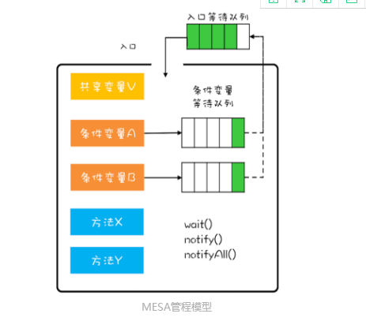

## Java内存模型(JMM)


如上图所示，为JMM内存模型，每一个线程都有自己的工作内存，这里保存了变量的副本，所有的修改操作都是在工作内存中完成后，刷新到主内存，内存之间的通信也是通过主内存进行的。由于上面的内存模型定义，产生了两个非常重要的并发编程问题。

- 线程之间如何通信，通过写-读主内存的内容来进行同步
- 线程之间如何同步，

## synchronized实现原理

### Java对象头

对象在内存中分为三块区域：

- 对象头

  1. MarkWord(标记字段)，默认存储对象的HashCode，分代年龄和锁标志位信息。里面存储的数据会随着锁标志位的变化而变化。
  2. Klass Point(类型指针)，对象指向它的类元数据指针，通过这个指针确定对象是那个类的实例

- 实例数据

  存放类的数据信息，父类信息

- 对齐填充

  虚拟机要求对象起始地址必须是8字节的整倍数，填充数据不是必须存在的，仅仅是为了字节对齐

32位虚拟机中对象头的组成


32位虚拟机中对象头的组成

64位虚拟机中对象头的组成


**biased_lock**：对象是否启用偏向锁标记，只占1个二进制位。为1时表示对象启用偏向锁，为0时表示对象没有偏向锁。
 **age**：4位的Java对象年龄。在GC中，如果对象在Survivor区复制一次，年龄增加1。当对象达到设定的阈值时，将会晋升到老年代。默认情况下，并行GC的年龄阈值为15，并发GC的年龄阈值为6。由于age只有4位，所以最大值为15，这就是`-XX:MaxTenuringThreshold`选项最大值为15的原因。
 **identity_hashcode**：25位的对象标识Hash码，采用延迟加载技术。调用方法`System.identityHashCode()`计算，并会将结果写到该对象头中。当对象被锁定时，该值会移动到管程Monitor中。
 **thread**：持有偏向锁的线程ID。
 **epoch**：偏向时间戳。
 **ptr_to_lock_record**：指向栈中锁记录的指针。
 **ptr_to_heavyweight_monitor**：指向管程Monitor的指针。

### 管程

管程，对应的英文是Monitor，指管理共享变量以及对共享变量操作的过程，让他们支持并发。在管程的发展历史上分别有三种不同的管程模型，分别是Hasen模型，Hoare模型，MESA模型。

并发领域要解决的问题：

- 互斥：即同一时刻只允许一个线程访问共享资源。
- 同步：即线程之间如何通信，协作。

管程的解决方法：

- 互斥：将共享变量及其对共享变量的操作统一封装起来。

- 同步：利用条件变量和条件变量等待队列。

  

在管程模型里，共享变量和对共享变量的操作是被封装起来的，最外层的框就是封装的意思。每一个条件变量都对应一个等待队列。例如，现在线程T1执行阻塞队列的出队操作，如果队列是空的就到条件变量对应的等待队列里面等。如果T2执行阻塞队列的入队操作。队列满了，进入对应条件变量的等待队列里面等。

```java
//阻塞队列的实现上面的思想
public class BlockedQueue<T>{
  final Lock lock =
    new ReentrantLock();
  // 条件变量：队列不满  
  final Condition notFull =
    lock.newCondition();
  // 条件变量：队列不空  
  final Condition notEmpty =
    lock.newCondition();

  // 入队
  void enq(T x) {
    lock.lock();
    try {
      while (队列已满){
        // 等待队列不满 
        notFull.await();
      }  
      // 省略入队操作...
      //入队后,通知可出队
      notEmpty.signal();
    }finally {
      lock.unlock();
    }
  }
  // 出队
  void deq(){
    lock.lock();
    try {
      while (队列已空){
        // 等待队列不空
        notEmpty.await();
      }
      // 省略出队操作...
      //出队后，通知可入队
      notFull.signal();
    }finally {
      lock.unlock();
    }  
  }
}
```

1. Hasen 模型里面，要求 notify() 放在代码的最后，这样 T2 通知完 T1 后，T2 就结束了，然后 T1 再执行，这样就能保证同一时刻只有一个线程执行。
2. Hoare 模型里面，T2 通知完 T1 后，T2 阻塞，T1 马上执行；等 T1 执行完，再唤醒 T2，也能保证同一时刻只有一个线程执行。但是相比 Hasen 模型，T2 多了一次阻塞唤醒操作。
3. MESA 管程里面，T2 通知完 T1 后，T2 还是会接着执行，T1 并不立即执行，仅仅是从条件变量的等待队列进到入口等待队列里面。这样做的好处是 notify() 不用放到代码的最后，T2 也没有多余的阻塞唤醒操作。但是也有个副作用，就是当 T1 再次执行的时候，可能曾经满足的条件，现在已经不满足了，所以需要以循环方式检验条件变量。

下面是Java中管程的实现


### 各种锁

锁的升级顺序如下

- 偏向锁：解决同一个线程多次获得锁时候的代价。
- 轻量级锁：如果一个对象虽然有多线程访问，但多线程访问的时间是错开的（也就是没有竞争），那可以使用轻量级锁来优化。轻量级锁对使用者是透明的，即语法依然是synchronized

#### 偏向锁

在第一次进入的时候，需要CAS将线程ID放在对象的MarkWord头，之后发现线程ID是自己的就表示没有竞争，不需要重新CAS。只要不发生竞争，这个对象就归线程所有。

- 调用hashcode()方法，会导致偏向锁被禁用，直接调用轻量级锁。因为偏向锁的Markword中没有存储hashcode的位置，轻量级锁会在锁记录中记录hashCode，重量级锁会在Monitor中记录hashCode。

- 当有其他线程调用偏向锁对象的时候，会升级成轻量级锁。注意，是在当前线程执行完synchronized方法之后调用，否则就会升级成重量级锁。

- 调用wait，notify也会撤销偏向锁，因为只有重量级锁有这两个方法。

#### 轻量级锁

加锁过程：

1. 创建锁记录对象(LockRecord)，每个线程的栈帧都会包含一个锁记录的结构，内部可以存储锁定对象的Mark Word。

    

2. 让锁记录中的Object reference指向锁对象，并尝试用cas替换Object的Mark Word，将MarkWord存入锁记录（就是这里存储了HashCode）。

    

3. 如果cas替换成功，对象头中存储了锁记录的地址和状态00，表示由该线程给对象加锁。

    

4. 如果cas失败，有两种情况

    (1)如果是其他线程持有了Object的轻量级锁，表名有竞争，进入锁膨胀过程。

    (2)如果是自己执行了synchronized锁充入，则在添加一条LockRecord作为重入的计数。

    

锁膨胀：如果别的线程CAS的时候，发现已经有线程加了偏向锁1，自己会申请Monitor锁，让Object指向重量级锁地址，同时自己进入Monitor的EntryList阻塞。

自旋转优化：如果在争取的时候发现阻塞，可以先自旋尝试获取锁，失败10次后进入锁膨胀。

#### 重量级锁

Java中Monitor的详细情况

加入synchonized之后，在子字节码中会出现MonitorEnter和MonitorExit两条指令。

